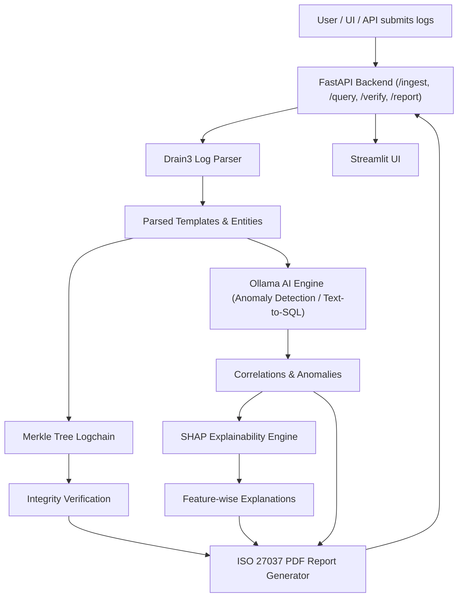

# AI-Powered Forensic Log Investigation Framework

A next-generation log investigation system using **Ollama** and open-source tools.  
It transforms raw logs into structured forensic evidence, ensures integrity using **Merkle Trees**, and provides explainable AI insights suitable for audits, incident response, and legal proceedings.

---

## Features

- Intelligent log parsing using Drain3 automated template extraction  
- Forensic integrity via Merkle Tree–based logchain with tamper detection  
- AI-driven anomaly detection and attack path reconstruction  
- Natural language investigation using an Ollama-powered Text-to-SQL agent  
- Explainable AI decisions using SHAP waterfall plots  
- ISO 27037–aligned, court-ready forensic reports  

---

## Tech Stack

| Component | Tool |
|---------|------|
| LLM | Ollama (llama3.2) |
| Log Parsing | Drain3 |
| Explainability | SHAP |
| Graph Analysis | NetworkX |
| API | FastAPI |
| Database | SQLite (dev) / ClickHouse (prod) |
| Reports | Jinja2 + WeasyPrint |
| UI | Streamlit |

---

## Architecture (Mermaid.js)



---

## Quick Start

### Prerequisites

* Python 3.11+
* uv (fast Python package manager)
* Ollama with a model pulled

```bash
ollama pull llama3.2
```

---

## Installation

```bash
cd forensic_framework

uv sync
uv sync --extra dev
uv sync --extra ml
```

---

## Running the API

```bash
uv run uvicorn src.forensic_framework.main:app --reload --port 8000
```

Endpoints:

* `/ingest`
* `/query`
* `/verify`
* `/report`

---

## Running Tests

```bash
uv run pytest tests/ -v
```

---

## Project Structure

```text
forensic_framework/
├── src/forensic_framework/
│   ├── ingestion/        # Drain3 log parsing
│   ├── integrity/        # Merkle Tree logchain
│   ├── ai_engine/        # Ollama agents and anomaly detection
│   ├── explainability/   # SHAP visualizations
│   ├── reporting/        # ISO 27037 PDF reports
│   ├── api/              # FastAPI routes
│   └── storage/          # Database layer
├── tests/
└── pyproject.toml
```

---

## Usage Examples

### Parse Logs with Drain3

```python
from forensic_framework.ingestion import DrainParser

parser = DrainParser()
result = parser.parse(
    "Failed password for root from 192.168.1.100 port 22 ssh2"
)

print(result.template)
```

---

### Verify Log Integrity

```python
from forensic_framework.integrity import LogChain

chain = LogChain()
chain.add_evidence_block(logs)

is_valid = chain.verify()
```

---

### Natural Language Query

```python
from forensic_framework.ai_engine import OllamaAgent

agent = OllamaAgent()
result = agent.query(
    "Show me all failed SSH logins from yesterday"
)
```

---

## Forensic Guarantees

* Deterministic evidence hashing
* Tamper-evident chain of custody
* Explainable AI decisions
* ISO 27037–aligned reporting

---

## License

MIT License

```
